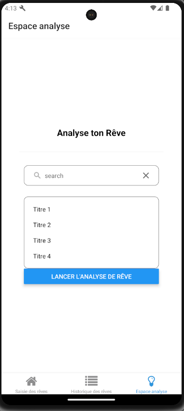

# Dream-Journal-App


## tech stack

- React Native

- TypeScript

- Expo

  

# Getting started


## Initialisation :
Clone the repo and go at the root :  ```cd Dream-Journal-App```. 

Then execute :
  
```bash 
npm install 
``` 
## Launch server 

At the root of the directory, execute : 
```bash
npx expo 
```

You can use the QRCode to open the app on your smartphone with expo go, or with your browser or Android Studio.

**Important**! To use the API [MeaningCloud](https://www.meaningcloud.com/developer/apis) you will need to get an API key and place it in components/dreamAnalysis.tsx at line 51 (at apiKey variable).

# Structure and Architecture

The application works on a system of Tabs to change page and use the AsyncStorage to stock the dreams.


# Implemented features

- Add a dream via a form (Title, description, luicid dream, nightmare).

- Consult dream history:
	- Display description and characteristics
	- Search bar
	- Delete a dream

- Semantic analysis of dreams using the external API [MeaningCloud](https://www.meaningcloud.com/developer/apis).

# Screenshots



